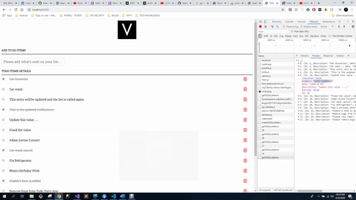

# TODO-Angular-GO-App
TODO CRUD Angular( 9 )app with GO Lang Server

 

Install: Enviroment
1.	Install go: https://golang.org/

2.	Install node js: https://nodejs.org/

3.	Install environment variables:-
•	For Windows user: create a GOPATH system variable by go to Control Panel > System > Advance system settings > Advanced tab > Environment Variables > Under system variables > create a new variable "GOPATH", value "C:\Go\bin"
•	For Mac user: open terminal, type export GOPATH=$GOROOT/bin

4.	Project location of "TODO-Angular-GO-App"
•	For windows user, extract this project to C:\Go\src\
•	For Mac user, extract this project to anywhere you want
Install: Project dependencies
   a.	Open command line/terminal: navigate to Client folder, type "npm install"
   b.	Open command line/terminal: navigate to server folder, type "go get"

Run it

5.	Client
o	Open command line/terminal: navigate to Client folder, type "npm start"
o	Open browser: http://localhost:4200/

6. Server
o	Open command line/terminal: navigate to backend folder, type "go run main.go"
o	Open browser: http://localhost:8000/api/getToDoListItems

**in case you hit any $GOPATH error while running go command, please follow instruction https://golang.org/doc/install

Please use git bash or cmdr for better experience.

Author-- Shabih Sharfani

Improvements for future:
use of docker file to automate the process.

